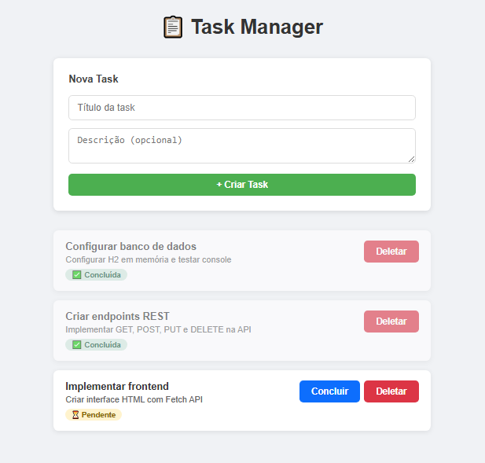

# 📋 Task Manager API

> Aplicação fullstack de gerenciamento de tarefas construída com **Spring Boot**, **JPA**, **H2** e **JavaScript puro** — seguindo o padrão arquitetural **MVC** com estrutura de **microsserviço**.

---

## 🚀 Tecnologias

| Camada | Tecnologia |
|---|---|
| Backend | Java 17 + Spring Boot 4 |
| Persistência | Spring Data JPA + Hibernate |
| Banco de dados | H2 (in-memory) |
| Frontend | HTML5 + CSS3 + JavaScript (Fetch API) |
| Build | Maven |
| Versionamento | Git + GitHub |

---

## 🏗️ Arquitetura

A aplicação segue o padrão **MVC (Model-View-Controller)** com separação clara de responsabilidades em camadas:

```
┌─────────────────────────────────────────┐
│           FRONTEND (View)               │
│         index.html + app.js             │
│     Fetch API → requisições HTTP        │
└──────────────────┬──────────────────────┘
                   │ HTTP REST (JSON)
                   ▼
┌─────────────────────────────────────────┐
│         CONTROLLER (Spring)             │
│           TaskController.java           │
│   @RestController → /tasks endpoints   │
└──────────────────┬──────────────────────┘
                   │
                   ▼
┌─────────────────────────────────────────┐
│          SERVICE (Regras de negócio)    │
│            TaskService.java             │
│     Lógica de criação, update, delete   │
└──────────────────┬──────────────────────┘
                   │
                   ▼
┌─────────────────────────────────────────┐
│         REPOSITORY (Persistência)       │
│           TaskRepository.java           │
│    JpaRepository → CRUD automático      │
└──────────────────┬──────────────────────┘
                   │ JPA / SQL
                   ▼
┌─────────────────────────────────────────┐
│           DATABASE (H2)                 │
│         jdbc:h2:mem:taskdb              │
│       Tabela: TASKS (in-memory)         │
└─────────────────────────────────────────┘
```

### Por que essa estrutura é um microsserviço?

- **Responsabilidade única** — gerencia exclusivamente o domínio de tarefas
- **API REST stateless** — cada requisição é independente
- **Desacoplado** — qualquer cliente (React, Flutter, mobile) consome a API
- **Pronto para escalar** — basta trocar H2 por PostgreSQL e empacotar em container

---

## 📁 Estrutura do Projeto

```
taskmanager/
├── src/
│   └── main/
│       ├── java/com/michael/taskmanager/
│       │   ├── TaskmanagerApplication.java   # Entry point
│       │   ├── controller/
│       │   │   └── TaskController.java       # Endpoints REST
│       │   ├── service/
│       │   │   └── TaskService.java          # Regras de negócio
│       │   ├── repository/
│       │   │   └── TaskRepository.java       # Acesso ao banco
│       │   └── model/
│       │       └── Task.java                 # Entidade JPA
│       └── resources/
│           ├── static/
│           │   └── index.html                # Frontend
│           └── application.properties        # Configurações
└── pom.xml                                   # Dependências Maven
```

---

## 🔌 Endpoints da API

Base URL: `http://localhost:8080`

| Método | Endpoint | Descrição | Status |
|---|---|---|---|
| `GET` | `/tasks` | Lista todas as tasks | 200 OK |
| `GET` | `/tasks/{id}` | Busca task por ID | 200 OK |
| `POST` | `/tasks` | Cria nova task | 201 Created |
| `PUT` | `/tasks/{id}` | Atualiza uma task | 200 OK |
| `DELETE` | `/tasks/{id}` | Deleta uma task | 204 No Content |

### Exemplo de payload (POST/PUT)

```json
{
  "title": "Configurar banco de dados",
  "description": "Configurar H2 em memória e testar console",
  "status": "PENDING"
}
```

### Exemplo de resposta

```json
{
  "id": 1,
  "title": "Configurar banco de dados",
  "description": "Configurar H2 em memória e testar console",
  "status": "PENDING",
  "createdAt": "2026-05-18T12:42:13.819179"
}
```

---

## 🗄️ Modelo de Dados

```sql
CREATE TABLE tasks (
    id          BIGINT GENERATED BY DEFAULT AS IDENTITY PRIMARY KEY,
    title       VARCHAR(255) NOT NULL,
    description VARCHAR(255),
    status      VARCHAR(255) NOT NULL DEFAULT 'PENDING',
    created_at  TIMESTAMP
);
```

**Status possíveis:** `PENDING` | `DONE`

---

## ⚙️ Como executar localmente

### Pré-requisitos

- Java 17+
- Maven (ou usar o wrapper `mvnw` incluso)

### Passos

```bash
# Clone o repositório
git clone https://github.com/michaeljunioroliveira/task-manager.git
cd task-manager/taskmanager

# Execute a aplicação
./mvnw spring-boot:run

# Windows
mvnw.cmd spring-boot:run
```

Acesse:
- **Frontend:** http://localhost:8080/index.html
- **API:** http://localhost:8080/tasks
- **Console H2:** http://localhost:8080/h2-console

### Configuração do H2 Console

| Campo | Valor |
|---|---|
| JDBC URL | `jdbc:h2:mem:taskdb` |
| Username | `sa` |
| Password | *(vazio)* |

---

## 🖥️ Interface



A interface web permite:

- ✅ Criar tasks com título e descrição
- ✅ Visualizar todas as tasks com status visual
- ✅ Marcar tasks como **Concluída** (PUT)
- ✅ Deletar tasks com confirmação (DELETE)

> O frontend consome a API REST diretamente via **Fetch API** (JavaScript puro, sem frameworks).

---

## 🔄 Git Flow utilizado

```
main
├── feature/task-entity          # Entidade JPA
├── feature/repository-service   # Repository + Service
├── feature/task-controller      # Controller REST
├── feature/frontend             # HTML + JavaScript
└── chore/linguagem-github       # Configuração .gitattributes
```

---

## 📈 Próximos passos

- [ ] Substituir H2 por PostgreSQL
- [ ] Adicionar validações com `@Valid` e `@NotBlank`
- [ ] Implementar paginação no `GET /tasks`
- [ ] Adicionar autenticação com Spring Security + JWT
- [ ] Containerizar com Docker
- [ ] Criar testes unitários com JUnit + Mockito

---

## 👨‍💻 Autor

**Michael Oliveira**  
Software Developer | Java · Spring · APIs · Dados  
[](https://www.linkedin.com/in/michaeljunioroliveira)
[](https://github.com/michaeljunioroliveira)
